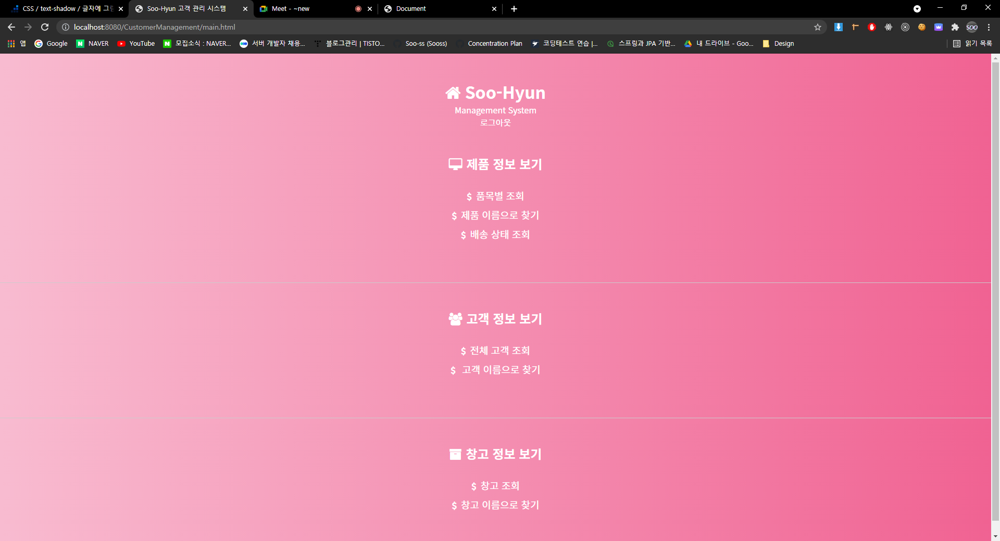
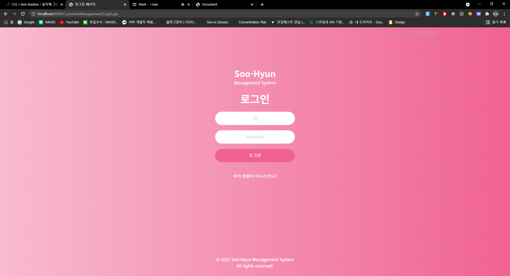
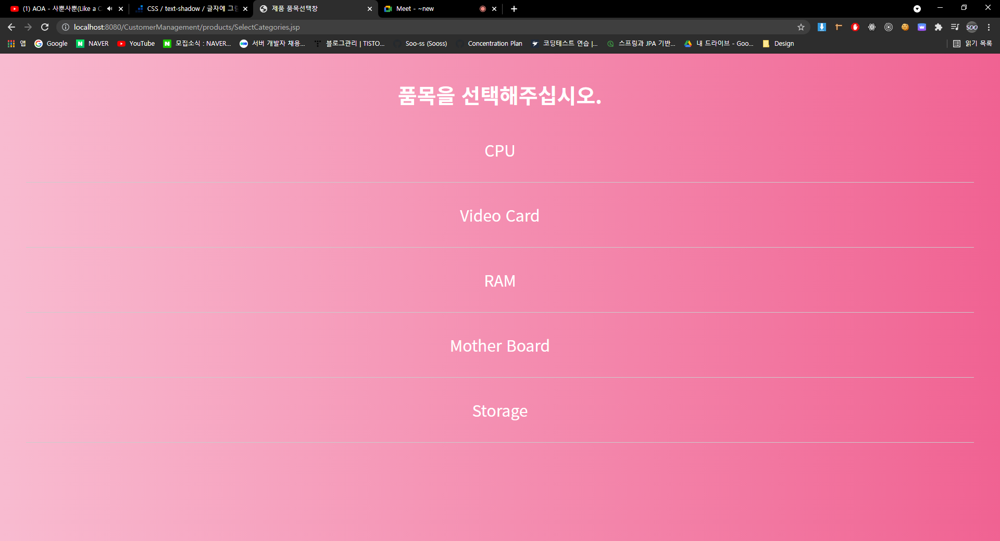
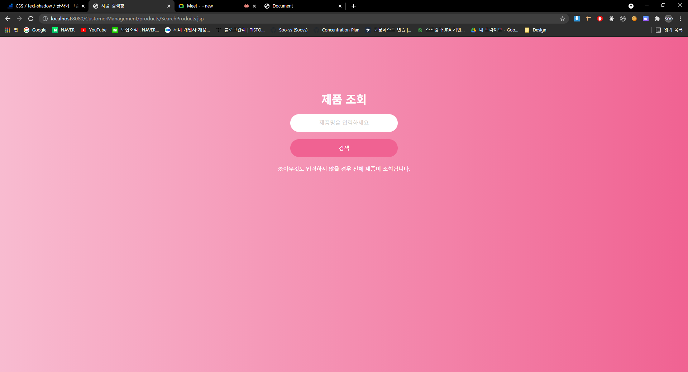
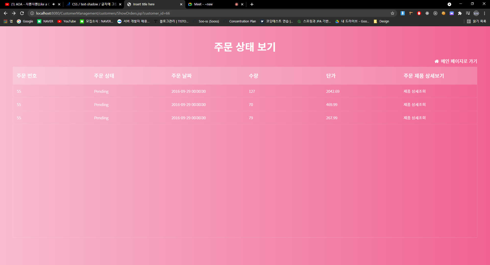

# 2021 Internet DB Assignment

2021 인터넷 DB 응용 팀 과제

## 사용 기술

- JSP
- CSS

## 구현 완료 기능

1. 로그인
2. 로그아웃
3. 품목별 조회
4. 제품 이름으로 찾기
5. 고객 이름으로 찾기
6. 선택된 고객이 구입한 내역 검색
7. 지역별 제품 재고 현황 조회
8. 회원가입
9. 창고 이름으로 검색
10. 배송 상태 조회
11. 필터 기능 (오름차순 `sorting`)

## 디자인

1. 핑크핑크
2. Noto Sans KR

### 주요 사진

- 메인
  

- 로그인
  

- 품목별 조회
  

- 제품 이름으로 찾기
  

- 선택된 고객이 구매한 내역
  
